  
  
  
  
  








![Experience. Dock.us, Software Engineer, March 2025 to present: AI features on Next.js, Node.js, GraphQL and AWS SQS. Turgon AI, Founding Engineer, October 2024 to June 2025: led a team across three AI products, 500+ PRs reviewed. AccioJob, SDE and Instructor, October 2022 to October 2024: 300+ features across four repos, taught 90,000+ students. STV Technologies, Founder, October 2021 to August 2022: freelancing firm at 20, 30+ projects, INR 10L revenue. Plus fullstack and mobile internships at Attrilu and Fitzura in 2022.](assets/experience.svg)





  
  

<!-- Self-hosted, real contribution data, no third-party service in the loop.
     Regenerated daily by .github/workflows/update-profile-art.yml -->

  

 


<!-- ------------------------------------------------------------------ -->

Plain-text version (for screen readers and search)

### Avi Vashishta

Software Engineer at **[Dock.us](https://dock.us)**. 23, based in New Delhi,
India. BTech in Computer Science from IIIT Delhi, class of 2024.

I build AI products, web platforms, mobile apps and 3D interfaces. Along the way
I've taught the MERN stack to over 100,000 developers, reviewed 500+ pull
requests as a founding engineer, shipped at two YC-backed companies, and
published two books.

**Currently** — at Dock since March 2025, shipping AI-powered features on a
Next.js, Node.js and GraphQL stack with AWS SQS for asynchronous messaging.
I own features end to end: schema, API, interface, rollout.

**Experience**

| Where | Role | When | What |
| --- | --- | --- | --- |
| [Dock.us](https://dock.us) | Software Engineer | Mar 2025 – present | AI features on Next.js, Node.js, GraphQL, AWS SQS |
| Turgon AI | Founding Engineer | Oct 2024 – Jun 2025 | Led a team across three AI products; 500+ PRs reviewed |
| AccioJob (YC 2021) | SDE · Instructor | Oct 2022 – Oct 2024 | 300+ features across four repos; taught 90,000+ students |
| STV Technologies | Founder | Oct 2021 – Aug 2022 | Freelancing firm at 20; 30+ projects, INR 10L revenue |
| Attrilu | Fullstack Intern | Feb – Apr 2022 | Meta APIs; Next.js and Django app for creators |
| Fitzura | Mobile App Intern | Jan – Mar 2022 | Fitness app in React Native with a Django backend |

**Stack** — React, Next.js, TypeScript, Tailwind, Redux, Zustand · Three.js,
R3F, GSAP, Framer Motion, MediaPipe · Node.js, NestJS, Express, GraphQL, Python,
Django · LangChain, Vercel AI SDK, OpenAI, Eleven Labs · PostgreSQL, Prisma,
MongoDB, Firebase, Upstash Redis · AWS, Docker, CI/CD, Vercel, Supabase,
PostHog · React Native, Expo, Kotlin, Unity, C#

**Selected work**

| Project | What it is | Stack |
| --- | --- | --- |
| [Portfolio v3](https://www.avivashishta.com) | The only dev portfolio with real-time hand-gesture and head-tracking controls, plus a 27-command terminal | React 19, Three.js, R3F, GSAP, MediaPipe |
| [AI For Messaging](https://github.com/orgs/whatsapp-ai-helper/repositories) | Turns rough thoughts into effective messages, by chat or voice. No signup | React Native, Flask, OpenAI |
| [BOLDBot](https://github.com/BoldStore/bold-bot-frontend) | Automates customer service for Instagram businesses | Next.js, NestJS, Redux, Firebase |
| [BOLD Store](https://github.com/BoldStore/MobileApp) | One-click marketplace — converts a Facebook feed into a store | React Native, Expo, Firebase, Node.js |
| [podcast-app-react-rec](https://github.com/AVIVASHISHTA29/podcast-app-react-rec) | Podcast platform with CRUD, custom player and auth | React, Firebase, Redux Toolkit |
| [crypto-dashboard-dec](https://github.com/AVIVASHISHTA29/crypto-dashboard-dec) | Crypto tracker with customizable watchlists and charts | React, Chart.js, Framer Motion |
| [Portfolio2021](https://github.com/AVIVASHISHTA29/Portfolio2021) | Animated personal portfolio site | React, Framer Motion, MUI |
| Infinite Rider | Flappy-bird-style infinite runner, shipped in 2D and 3D | Unity, C# |

**Also** — 17+ coding tutorials on YouTube with 100,000+ combined views. Two
books on Amazon: *Realis Reality* (written at 16) and *18 Things I Have Learned
at 18*. "Lockdown Wars", a podcast that hit 100,000+ streams in two months.

Portfolio: [avivashishta.com](http://www.avivashishta.com) ·
LinkedIn: [in/avivashishta](https://www.linkedin.com/in/avivashishta) ·
Email: avivashishta@gmail.com

Visuals in this README are hand-built SVGs in `/assets`, generated by `build_assets.py`. Chart data is real GitHub contribution data, last refreshed 2026-07-27.
